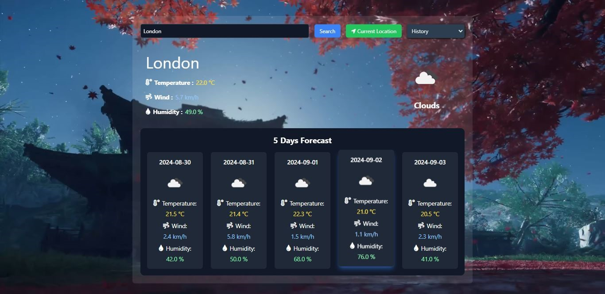
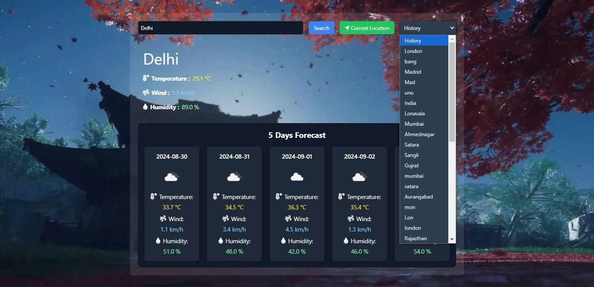
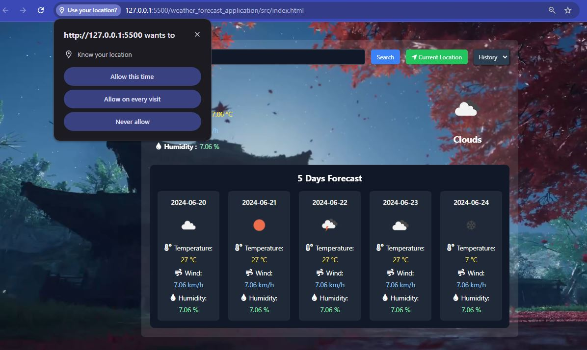

# SkyCast - Weather Forecast Application

SkyCast is a dynamic and responsive weather forecasting application developed using HTML, TailwindCSS, and JavaScript. Leveraging the OpenWeather API, SkyCast provides users with real-time weather updates for any city around the globe. The application also offers an extended five-day forecast for the selected city, giving users a comprehensive overview of upcoming weather conditions.

Key features include the ability to search for weather information by city name or automatically fetch weather details based on the user's current location. SkyCast’s user interface is designed to be intuitive and user-friendly, ensuring a smooth experience across various devices.

This project employs advanced DOM manipulation techniques and asynchronous JavaScript to handle API requests and dynamically update the UI based on user input. By integrating these modern web development practices, SkyCast delivers fast and reliable weather data with a seamless user experience.

## Features

- Search for Weather Infomation by City Name.
- Provides Forecast of Current Location.
- Saves Searched Cities.
- Responsive for all screen sizes.
- Uses Open Weather API.

## Screenshots

- Recently Searched Cities are stored in localStorage.

-  Automatically fetch weather details based on the user's current location. 

## Usage

- Use search box to get the weather forecast by city name.
- Enter Valid City name
- Use History Dropdown to get recently searched city.